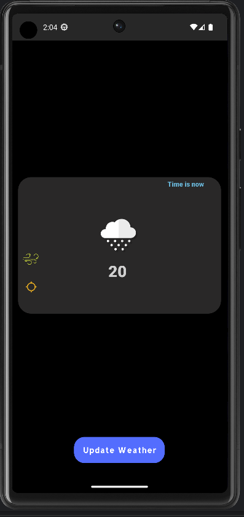
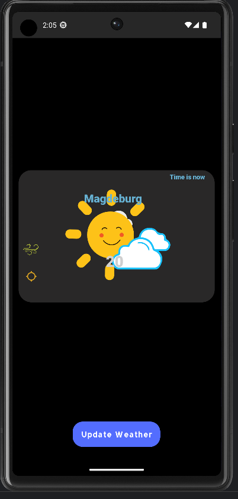
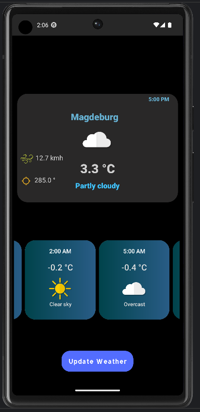
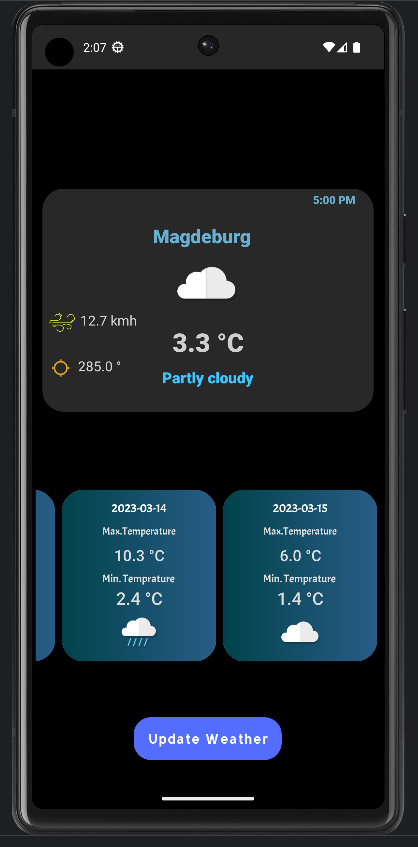

# Weather Application

Weather updates based on Current Location ( Latitude and Longitude).

### Tech Stack 
Kotlin, Flow , Coroutines, Jetpack Libraries Recyclerview with Multi viewHolders
 , MVVM with Repository Pattern 

Permission Required : Location, Internet

## Screenshots

 

### Developed by 

Api Used : https://open-meteo.com/

- [@AliJatoi](https://www.github.com/alijatoi)

